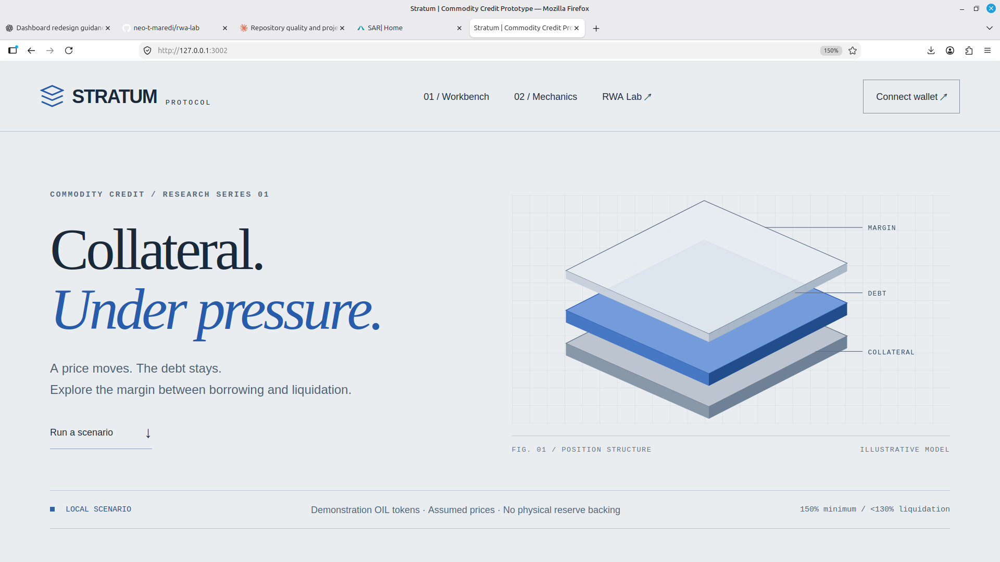
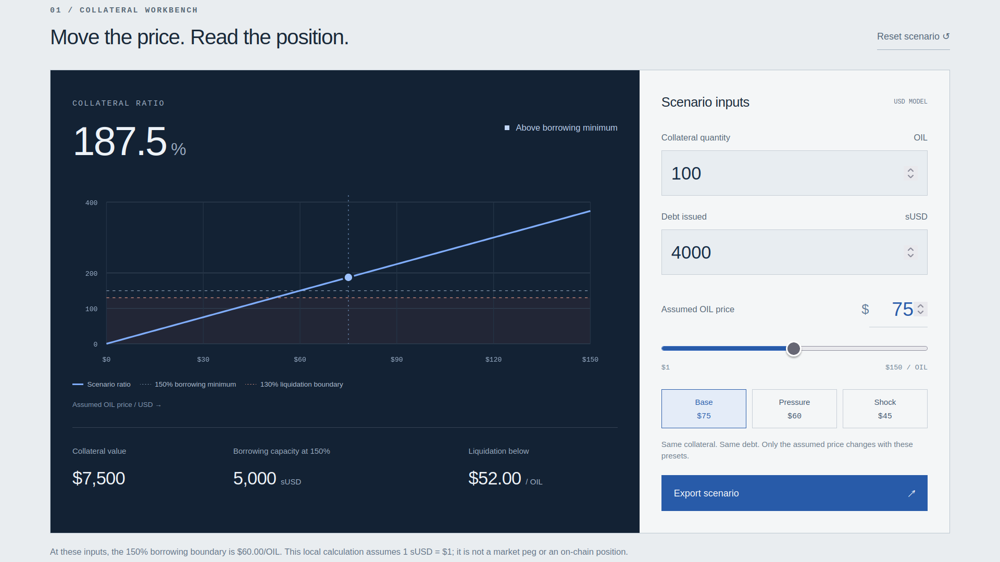

# Stratum Protocol

A commodity-credit prototype exploring collateral deposits, debt issuance, repayment, and liquidation with demonstration OIL tokens and a mock price feed.

Part of [RWA Lab](https://github.com/neo-t-maredi/rwa-lab).



## Current implementation

| Component | Behaviour |
| --- | --- |
| OilCollateral | Owner-minted ERC-20 demonstration collateral |
| StratumStable | sUSD issuance restricted to a vault configured once by the deployer |
| StratumVault | Deposit/mint, repay/withdraw, position ratios, and full-position liquidation |
| MockPriceFeed | Controllable eight-decimal price; anyone can update it for demonstrations |
| Interface | React/Vite collateral stress workbench; local price scenarios, ratio chart, JSON export, and injected-wallet connection; writes disabled |

No physical custody, reserve verification, production oracle, stability fee, or guaranteed market peg is implemented. Historical Sepolia deployments do not receive these source changes automatically.

## Run locally

Install Foundry and Node.js/npm first. From the repository root:

```bash
git submodule update --init --recursive
forge fmt --check
forge test -vv
cd stratum-interface
npm ci
npm run check
npm run build
npm run dev -- --host 127.0.0.1
```

Open the URL Vite prints. The separate `interface/` directory is an older incomplete implementation; use `stratum-interface/`.

## Mint authorization update

Deploy the token and vault, then call `StratumStable.setVault(vaultAddress)` from the token deployer. Configuration rejects zero/non-contract addresses, cannot be repeated, and permits only that vault to mint. The deployment script performs this step and sends demonstration OIL to the signing deployer.

The four original integration scenarios pass with the restriction enabled. The liquidation test now sources the liquidator's sUSD from an actual borrow and transfer rather than unrestricted minting. Six additional tests cover configuration, authorization, and token accounting, including 256 unauthorized-mint fuzz runs.

This is a focused repair, not completion of the protocol. Do not connect the revised interface to the old unrestricted token. A new deployment, verification of its configuration, and transaction/UI validation are still needed before enabling writes.

## Model boundaries and remaining work

- Minimum borrowing ratio: 150%. Liquidation is permitted below 130%.
- Liquidation currently transfers the entire position collateral. The declared 10% bonus is not applied by the implementation.
- Oracle validation checks positive price but not age or round completion. The feed is a mock.
- Repaying all debt while leaving collateral needs a separate withdrawal-path review: the current withdrawal entry point rejects zero-debt positions.
- Existing contracts are not upgradeable through this patch.
- Frontend transaction receipt handling, refreshed position state, and corrected deployment configuration remain follow-up work. Writes are intentionally disabled.

## Collateral workbench

The interface models price stress without requiring a wallet. Adjust collateral quantity, debt, and the assumed OIL price; inspect the ratio and thresholds; export the scenario inputs and derived values as JSON. These calculations run locally and assume 1 sUSD = $1. They do not read a live oracle or demonstrate a market peg.



The captured base scenario shows 187.5% collateralization, $7,500 collateral value, 5,000 sUSD borrowing capacity at 150%, and liquidation eligibility below $52/OIL. The borrowing minimum is reached at $60/OIL.

Desktop captures were supplied from the running localhost application on 29 September 2026. The workbench image shows the Base state. See [capture notes](docs/SCREENSHOTS.md) for provenance and remaining checks.

## Verification

Contract validation on 29 September 2026: Foundry 1.7.1, 10 tests passed, 0 failed, including 256 fuzz cases. Formatting checks passed. See [validation notes](docs/VALIDATION.md) for frontend results and limitations.
